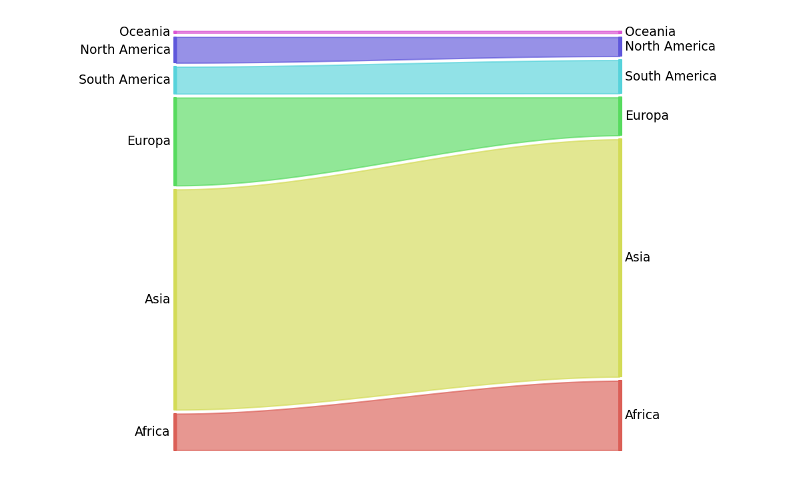
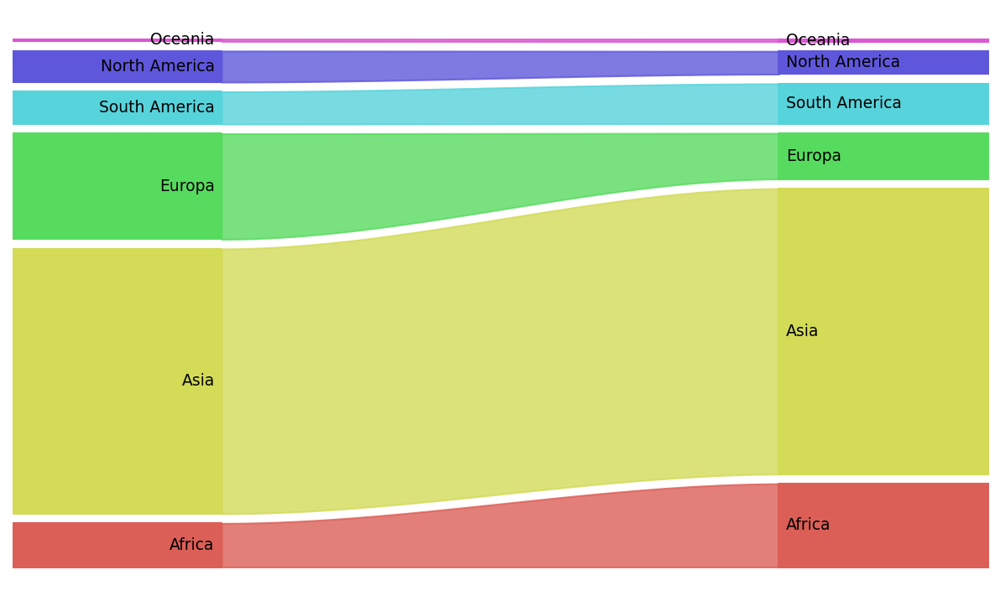
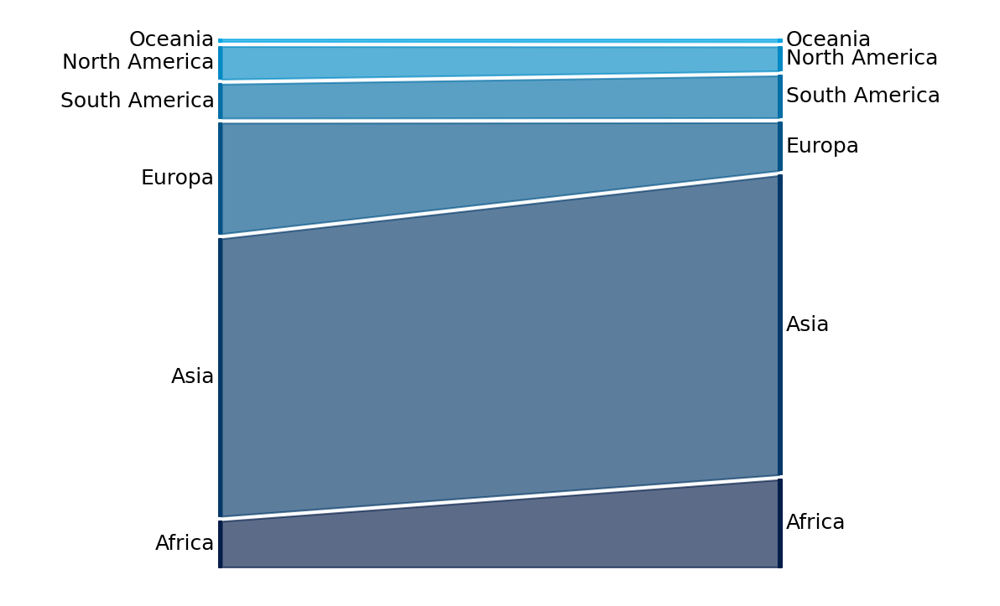
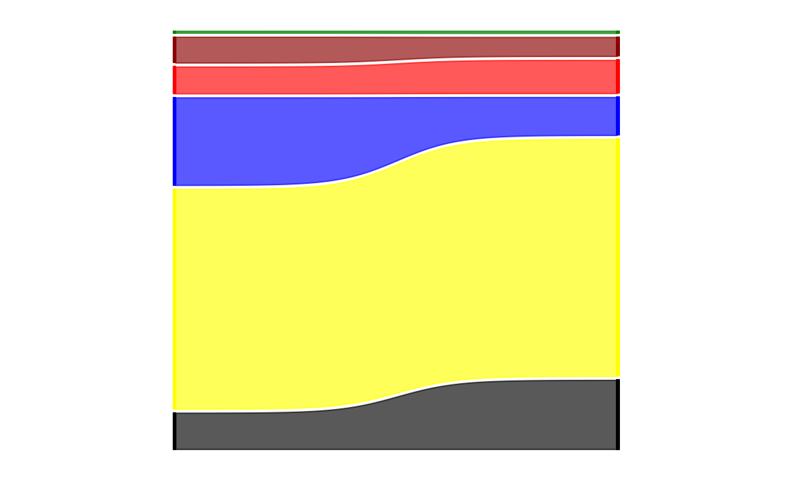

# Proportion-Plot

Create a proportion plot with Python from a DataFrame.

## Proportion Plot

A proportion plot is showing evolution of proportion between two different times. 

On the left you have the proportion at the first time, and on the left at the last time, with strips connecting them.

This is a sample proportion plot:

[Data Source](https://www.ksh.hu/interaktiv/grafikonok/vilag_nepessege_en.html)

## How to create a proportion plot

First, create a dataframe with your data. 

For example, here, we create it from a csv file:

    df = pd.read_csv('sample.csv')

All you have to do is to import the library and create a proportion plot:

    import propplot as pp
    pp.proportion_plot(df)

So you will have this output:

## Options

Many options are available if you want to create a more specific plot:

| Parameter | Default | Values/Type | Description |
| ----------- | ----------- | ----------- | ----------- |
| df | MANDATORY | Pandas DataFrame | The dataframe with 3 columns: names, first value (left), last value (right) |
| color_dict | None | Array of colors | Will be used for each class. Must be of same length than data. You can use RGB values ('#00AACC') or color names ('lightblue') |
| color_palette | 'hls' | Seaborn color palette | You can use any Seaborn palette, and the code will choose the right number of colors from it. Special value: 'Teamwork' (use the dark blue to the light blue colors). Ignored if color_dict is not None |
| vertical_space | 1 | Number | Vertical spacing between classes (in the unit of the data). Can be 0 for no vertical space |
| fontsize | 9 | Integer | Text size for the class names (matplotlib fontsize) |
| with_text | True | Boolean | Indicates if class names are shown or not |
| text_inside | False | Boolean | Indicates if class names are in color blocks (False: outside of graph, True: inside graph color blocks). Ignored if with_text=False |
| with_axis_title | False | Boolean | Indicates if column names are to be shown or not (under the bars). |
| alpha | 0.65 | [0..1] float | Indicates the alpha value for the strips in the middle of the graph. 0 means invisible strips, 1 means strips are in the same color than the bars |
| mode | 'smooth' | 'linear', 'sigmoid', 'smooth' | How to connect strips from one side to another one. Sigmoid has a bigger angle in the middle than smooth, and linear are just straight lines. |
| image_filename | None | PNG filename | If not none, the graph is displayed AND save with the name given |

## More samples

    pp.proportion_plot(df, alpha=0.8, text_inside=True, vertical_space=2)
    

    pp.proportion_plot(df, color_palette='Teamwork', fontsize=12, mode='linear')
    

    pp.proportion_plot(df, color_dict=['black', 'yellow', 'blue', 'red', 'darkred', 'green'], with_text=False, mode='sigmoid')

## To do / roadmap

New options are on the roadmap:
* border with big width (choose size)
* text color
* fig size
* curve strip
* title placement (top, bottom)

## Author and licence

Proportion plot library is under GNU GPL v3 licence.

Author: Virginie Mathivet, virginie.mathivet [at] teamwork.net